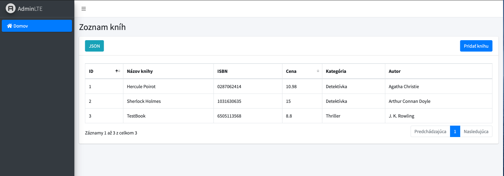
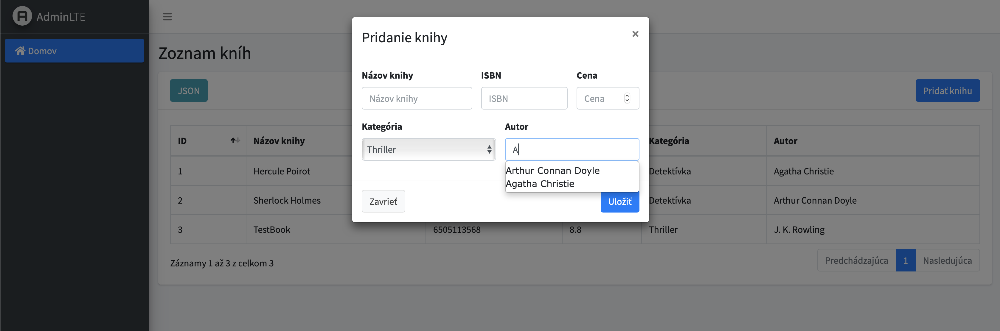
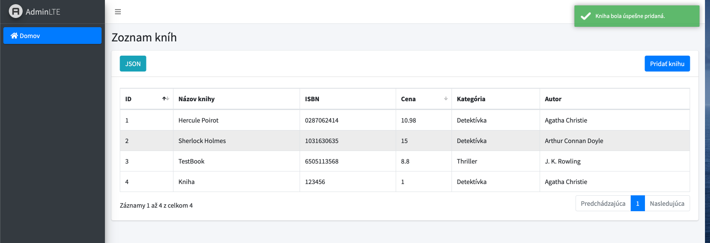
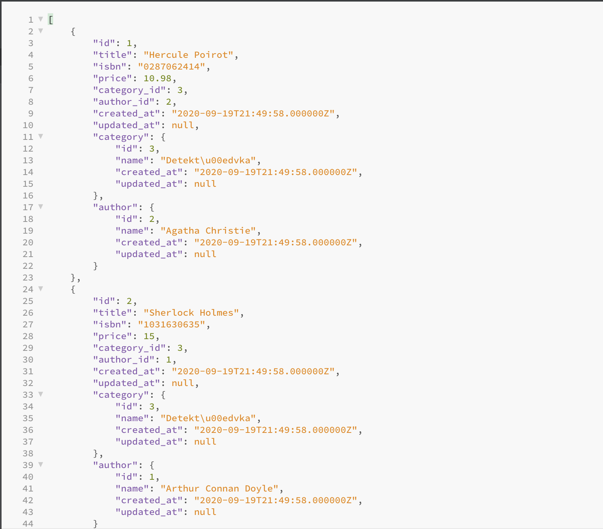

# DigitalLibrary

A simple website where a user can add books. Project was made using Laravel 7 and Admin Panel v3 as a theme.

## Installation

Clone this repository and run prepared migrations and seeds.

## Screenshots

